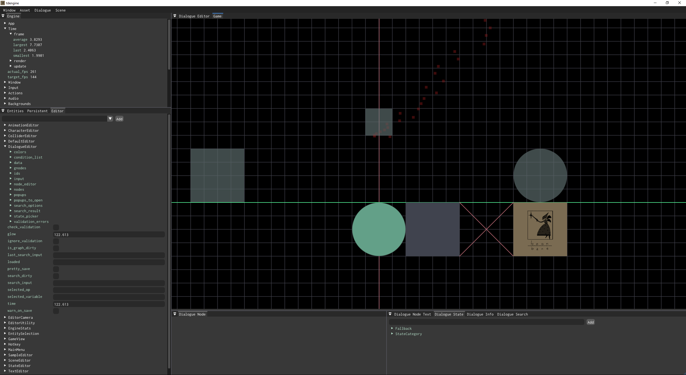

## What is this?
My 2D toolkit for making games and tech demos. After I put out the demo for [Deep Copy](https://store.steampowered.com/app/2639990/Deep_Copy/), I wanted to make something else for a while. I took the Deep Copy engine and ripped out all the game-specific code.

## How do I use this?
Well, you probably shouldn't. It's for my personal use, mostly. If you're really curious, it is very simple to compile. The intended use of the engine is that I fork it for a new project; it's not an SDK or something to be installed. Just fork the repository and build the solution in `./build/windows/DeepCopy.sln`. You'll also need to have Python installed and on the path.

The engine is Windows only. All of the binaries (`LuaJIT`, `GLFW`, `FreeType`, and `Steam`) are pre-compiled with an older MSVC. The game is built as a single translation unit; all the source files are included in `main.cpp`.

Really, buyer beware. I did my best pulling out all the Deep Copy code, but in making APIs consistent and fixing bugs, there were a lot of things I didn't test like I would for a professional piece of software. It's almost certain that there are latent bugs, or old API calls in Lua which will only error at runtime.

## Why did you do this?
Writing your own game engine is pure folly, but writing your own game is very reasonable and productive. I like commercial engines, but I enjoy writing all the software for my games, and I wanted to keep the real and hard fought benefits I gained from making my first commercial game:
- Hotloading your software is the most important thing in your development environment. It should work every time, and you shouldn't have to sacrifice debuggability or put restrictions on what can be hotloaded.
- Hotloading assets is nearly as important.
- LuaJIT has the best C FFI, and can be used for 99% of code in a game. It's incredible to use, and I want to use it every day.
- Big picture architectures for games of the scale I make are a waste of time. Everything doesn't need to be tightly packed SOAs of `Component`s that get processed in `System`s. Sometimes, those things are appropriate, but I want something that lets me easily make those things on top of the core engine rather than be a part of it.
- Having a good UI for tweaking your data is important. 

I wanted a base layer that incorporated all these things, and I was happy with the Deep Copy engine. Here's what the engine is:
- A base C++ layer, which loads assets, reads inputs, creates a window, provides an entry point, etc.
- ImGui, for making editor GUIs. I pull in CImGui to easily bind to Lua.
- A base Lua layer, which provides nice APIs for everything I've needed to write a game. For example:
  - `tdengine.audio` lets you easily play sounds and interpolate their volume and cutoff
  - `tdengine.input` provides contextual input, where raw inputs from the base engine are filtered based on where you are in the game (e.g. a menu versus a level)
  - `tdengine.physics` checks for and resolves collisions

Then, there's the game code. I call this `user code`.
## Where does my game go?
I split up user code into classes, each of which the engine maintains a list of. Each of these classes has hooks that the engine will call.

### `tdengine.entity`
`tdengine.entity` defines something which exists in your scene and which updates every frame. For example:
```lua
SampleEntity = tdengine.entity.define('SampleEntity')

SampleEntity.components = {
  'Collider'
}

function SampleEntity:init() 
end

function SampleEntity:draw()
  tdengine.ffi.set_world_space(true)
  tdengine.ffi.set_layer(100)

  tdengine.ffi.draw_circle_sdf(0, -100, 100, tdengine.colors.zomp:to_vec4(), 2)
end
```

### `tdengine.component`
`tdengine.component` defines a named bundle of data on an entity that is automatically serialized.
```lua
SampleComponent = tdengine.component.define('SampleComponent')

function SampleComponent:init(params)
  self.foo = params.foo or 42
end
```

### `tdengine.subsystem`
- `tdengine.subsystem` defines a singleton which has some hooks that the engine will call into. 
```lua
SampleSubsystem = tdengine.subsystem.define('SampleSubsystem')

function SampleSubsystem:init()
end

function SampleSubsystem:on_scene_rendered()
  -- Blit the current frame to a texture to save for later, perhaps
end
```

### `tdengine.app`
- `tdengine.app` is just a subsystem with a well-known class name, since you need at least one to create a window and start the game.
```lua
local App = tdengine.define_app()

function App:init()
	self.native_resolution = tdengine.vec2(1920, 1080)

	self.window_flags = tdengine.enum.bitwise_or(
		tdengine.enums.WindowFlags.Windowed,
		tdengine.enums.WindowFlags.Border
	)
end

function App:on_init_game()
	tdengine.ffi.create_window('tdengine', self.native_resolution.x, self.native_resolution.y, self.window_flags)

	local icon_path = tdengine.ffi.resolve_format_path('image', 'logo/icon.png'):to_interned()
	tdengine.ffi.set_window_icon(icon_path)

	local render_target = tdengine.gpu.add_render_target('scene', self.native_resolution.x, self.native_resolution.y)

	local buffer_descriptor = ffi.new('GpuCommandBufferDescriptor')
	buffer_descriptor.num_vertex_attributes = 3
	buffer_descriptor.max_vertices = 64 * 1024
	buffer_descriptor.max_draw_calls = 256
	buffer_descriptor.vertex_attributes = ffi.new('VertexAttribute[3]')
	buffer_descriptor.vertex_attributes[0].count = 3
	buffer_descriptor.vertex_attributes[0].kind = tdengine.enums.VertexAttributeKind.Float:to_number()
	buffer_descriptor.vertex_attributes[1].count = 4
	buffer_descriptor.vertex_attributes[1].kind = tdengine.enums.VertexAttributeKind.Float:to_number()
	buffer_descriptor.vertex_attributes[2].count = 2
	buffer_descriptor.vertex_attributes[2].kind = tdengine.enums.VertexAttributeKind.Float:to_number()
	local command_buffer = tdengine.gpu.add_command_buffer('scene', buffer_descriptor)

	tdengine.gpu.add_render_pass('scene', command_buffer, render_target, nil, tdengine.enums.GpuLoadOp.Clear)
end
```
### `tdengine.callback`
- `tdengine.callback` is nothing more than a named function, so it can be referred to from the editor.
```lua
tdengine.callback.register('sample', function()
  return 69
end)
```
